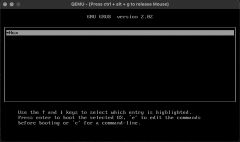

# The Hux Kernel


Hux - An x86 32-bit single-CPU toy operating system kernel built from scratch, following [the OSTEP book](http://pages.cs.wisc.edu/~remzi/OSTEP/) structure and terminology.

|   Author    | Kernel Src LoC (temp)  | Tutorial LoC (temp) |
|   :---:     |         :---:          |       :---:         |
| Guanzhou Hu |      C + x86 ASM       |      Markdown       |
|  Aug. 2021  |         7850           |        10005        |


## Tutorial / Development Doc

I document the whole development process of Hux as a complete set of tutorials. They can be found at the [**WIKI pages 📝**](https://github.com/josehu07/hux-kernel/wiki) of this GitHub repository ✭.

If there are any typos / mistakes / errors, please raise an issue!


## Playing with Hux

Requires a Linux host development environment. Tested on Ubuntu Xenial, Bionic, & Focal.

Clone the repo, set up a development cross-compilation toolchain following [this wiki page](https://github.com/josehu07/hux-kernel/wiki/02.-The-Very-First-Skeleton), then build Hux by:

```bash
$ make clean
$ make
```

Or, if you just want to try out Hux without a development toolchain, download both the released kernel image `hux.iso` and the initial file system image `vsfs.img` (a little bit large) to the folder.

To run Hux in QEMU (currently only supports GUI VGA mode so requires a desktop host environment, "nographics" mode is coming soon), do:

```bash
$ make qemu
```

You will see the QEMU GUI popping up with GRUB loaded. Choose the "`Hux`" option with <kbd>Enter</kbd> to boot into Hux.

<p align=center>  </p>

For development setup & instructions, please check out the wiki pages (recommended). I have every single detail documented there.


## Goals

The main goal of Hux is to be **Understandable**: structured in a way that is easy to understand (not mimicking existing UNIX-like systems). OS development seems scary at first glance for beginners mostly because it involves too many hairy technical details. I admit that, in real-world systems, we must face the complexity to ensure compatibility, performance, robustness, security, etc. Yet, a toy kernel project would help demonstrate the key concepts of an operating system, including its most essential steps of development, layers of abstractions, and the ideas of virtualization, concurrency, and persistence.

Goals of the Hux kernel include:

1. **Understandability**: as stated above
2. **Minimalism**: a minimal workable core design
3. **Code clarity**: though monolithic kernel, I will try to keep the code structure modularized
4. **Experimentalism**: not strictly following UNIX flavor, not targeting at practical use

I choose to write it in *C* language with `i386-IA32` architecture, since beginners tend to be more comfortable with this combination. More up-to-date system programming languages like *Rust* are great choices for modern 64-bit OS dev (Philipp is making his Rust OS kernel [here](https://os.phil-opp.com/)), but I will start with easier settings for now to maintain better understandability. Rust itself is still "niche" (maybe not?) and you have to incorporate some of its "dark magics" to succeed in OS dev. It definitely confuses new learners.

These are general and long-term goals which I will (hopefully) follow throughout the project. I hope this can lead towards a full HuxOS which we can install on real devices and play with in the future (kept simple, of course 😁)


## References

Main references:

- [The OSDev Wiki](https://wiki.osdev.org/) (IMPORTANT ✭)
- [JamesM's Kernel Tutorial](http://www.jamesmolloy.co.uk/tutorial_html/) by James, along with its [known bugs](https://wiki.osdev.org/James_Molloy's_Tutorial_Known_Bugs)
- [Writing an OS in Rust](https://os.phil-opp.com/) by Philipp (still updating...)
- [The xv6 Kernel](https://github.com/mit-pdos/xv6-public) x86 ver. by MIT PDOS (no longer updated)

OS conceptual materials:

- [Operating Systems: Three Easy Pieces](http://pages.cs.wisc.edu/~remzi/OSTEP/) (OSTEP) by Prof. Arpaci-Dusseaus
- My [reading notes](https://www.josehu.com/notes) on OSTEP book & lectures

Check the "References" section [here](https://github.com/josehu07/hux-kernel/wiki/01.-Prerequisite-Readings) for the full list.


## TODO List

- [x] The basic kernel skeleton
- [x] VGA text mode driver
- [x] Debugging utilities stack
- [x] Interrupts & timer
- [x] Keyboard input support
- [x] Global descriptors table
- [x] Virtual memory (paging)
- [x] Heal memory allocators
- [x] Process user mode execution
- [x] Essential system calls
- [x] Time-sharing scheduler
- [x] Basic IDE disk driver
- [x] Very simple file system
- [ ] Support for nographics mode
- [ ] More user-level utilities
- [ ] Thorough user-level tests
- [ ] Caching, swapping, & logging
- [x] Synchronization primitives
- [ ] Multi-threading concurrency
- [ ] Move to APIC & IOAPIC
- [ ] Direct memory access
- [ ] Extend Hux to Rux with Rust
